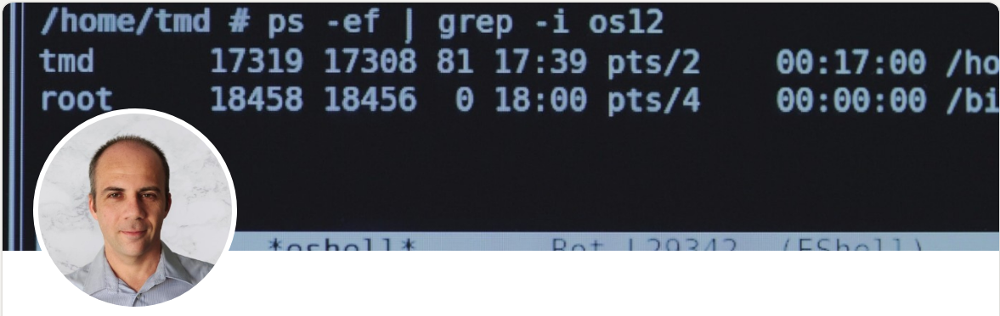

### Hi there 👋, my name is Evgeny

#### I am a software developer specializing in **Linux** and **low level programming**

##### About me

- I enjoy programming and engineering low level systems with focus on `storage`, `network` and `virtualization`
- Langauges I use for low level programming: `c/c++`, `rust`
- Langauges I use for automation and tooling: `python`, `go`, `bash`
- Languages I use to write functional code: `haskell`, `lisp`
- My power tools are: [`emacs`](https://www.gnu.org/software/emacs), [`nixos`](https://nixos.org) and [`xmonad`](https://xmonad.org)

